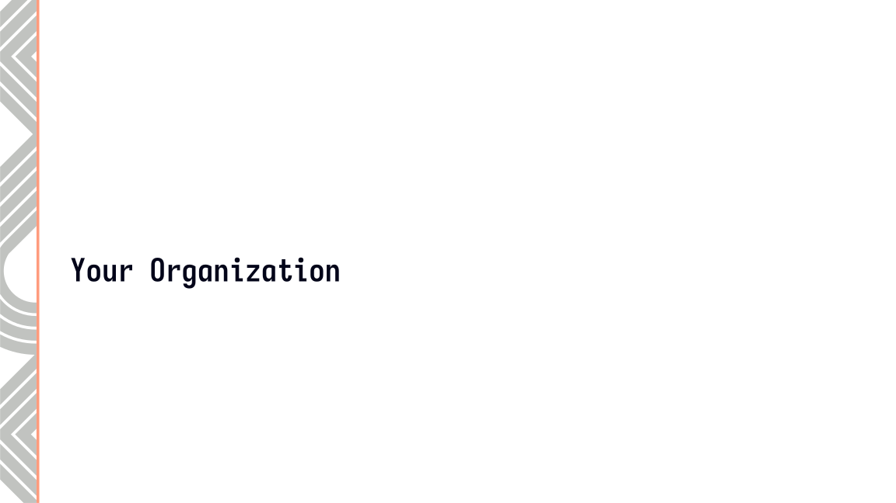
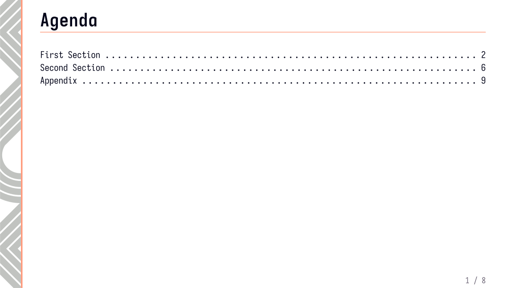
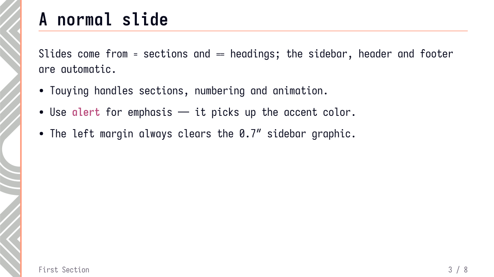
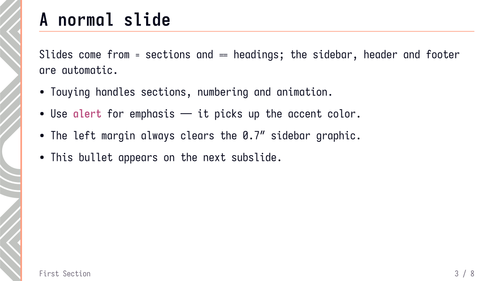
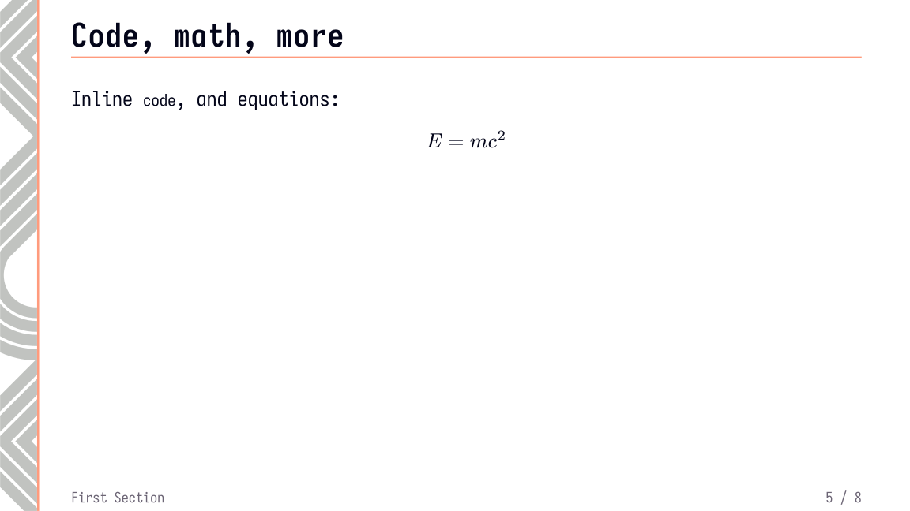
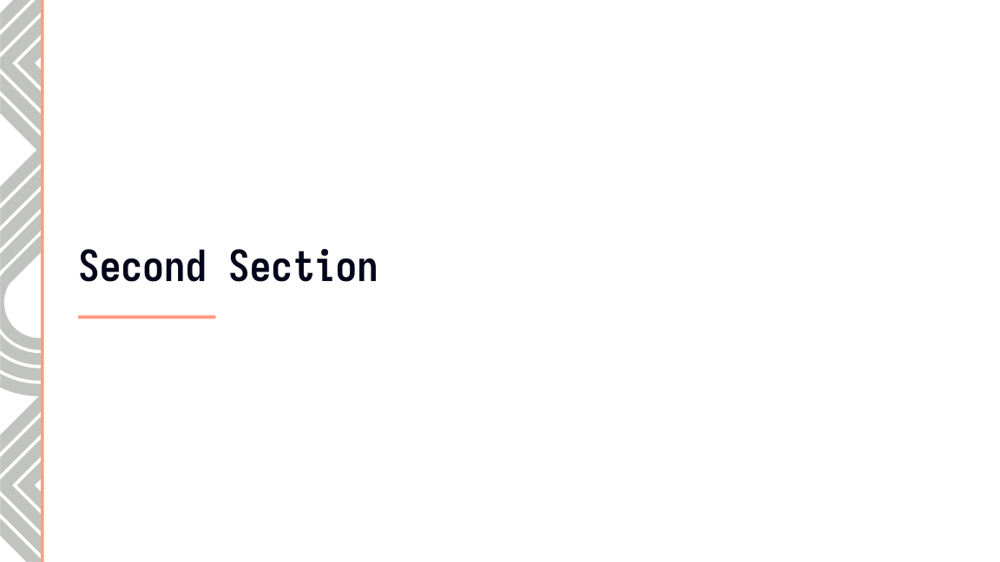
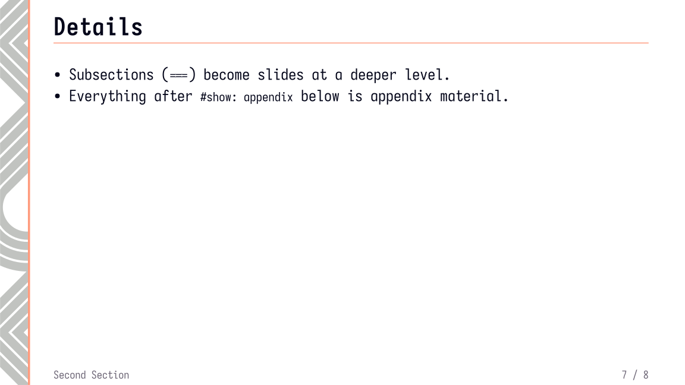
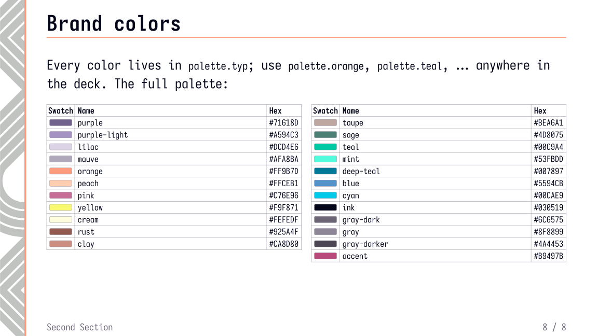
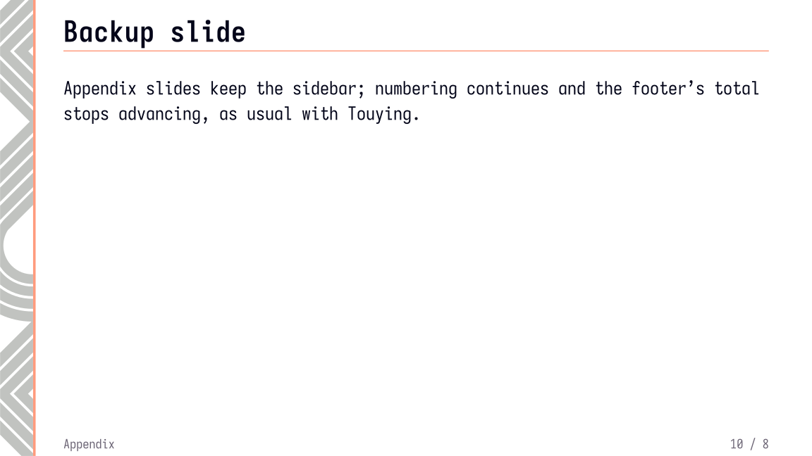

# Slide template (Typst + Touying)

Custom `typst` [Touying](https://typst.app/universe/package/touying/) presentation
theme.

```
main.typ       example deck — edit this
sidebar.typ    the theme (custom Touying theme wrapping the SVG art)
palette.typ    the brand palette (single source of truth for colors)
template.svg   the source art (unchanged)
colorpalette.svg  the original palette reference
fonts/         font fetch script target (Iosevka SS07; gitignored, see fonts/README.md)
```

## Preview

<!-- slides:start -->
| Slides (14) |
| --- |
|  |
|  |
|  |
|  |
|  |
|  |
|  |
|  |
|  |
|  |
|  |
|  |
|  |
|  |
<!-- slides:end -->

## Quick start

Requires **typst >= 0.15** and network access on first compile:

```sh
typst compile --font-path fonts main.typ          # PDF
typst compile --ppi 150 --font-path fonts main.typ "slide-{n}.png"
```

The `--font-path` config can be skipped if you have Iosevka font installed on your
system, for example from Homebrew.

Structure your deck with headings; the sidebar, header, footer and page numbers are
automatic:

```typst
#import "@preview/touying:0.8.0": *
#import "sidebar.typ": *

#show: sidebar-theme.with(
  config-info(
    title: [Your Deck Title],
    author: [Your Name],
    date: datetime.today(),
  ),
)

#title-slide()

= Section

== Slide title

- content ...

#focus-slide[One big idea.]
```

Available slide functions (from `sidebar.typ`): `slide`, `title-slide`, `outline-slide`,
`focus-slide`, plus automatic section dividers for each `= heading`,
`#speaker-note[..]`, `#pause` and friends (Touying built-ins).

## Customization

All of these go inside `#show: sidebar-theme.with(...)`:

- `footer:` bottom-left text (default: the current section title)
- `header-right:` top-right content (default: `info.logo`)
- `margin:` page margins dictionary
- `background:` `auto` (the SVG), an image path string, or `none`
- `config-colors(primary: ..)`, `config-info(..)`, and any other Touying `config-*` —
  they merge over the theme defaults

Colors come from `palette.typ`. The theme maps them onto Touying's roles: `primary` =
orange `#FF9B7D` (the sidebar bar), `secondary` = the anchor purple `#71618D`, body text
= ink `#030519`, meta text = `#6C6575`. `#alert[..]` uses the accent color `#B9497B`;
plain `*bold*` stays ink-colored (the theme sets `show-strong-with-alert: false`). Decks
can use any color directly:

```typst
#import "palette.typ": palette
#text(fill: palette.teal)[teal text]
```
