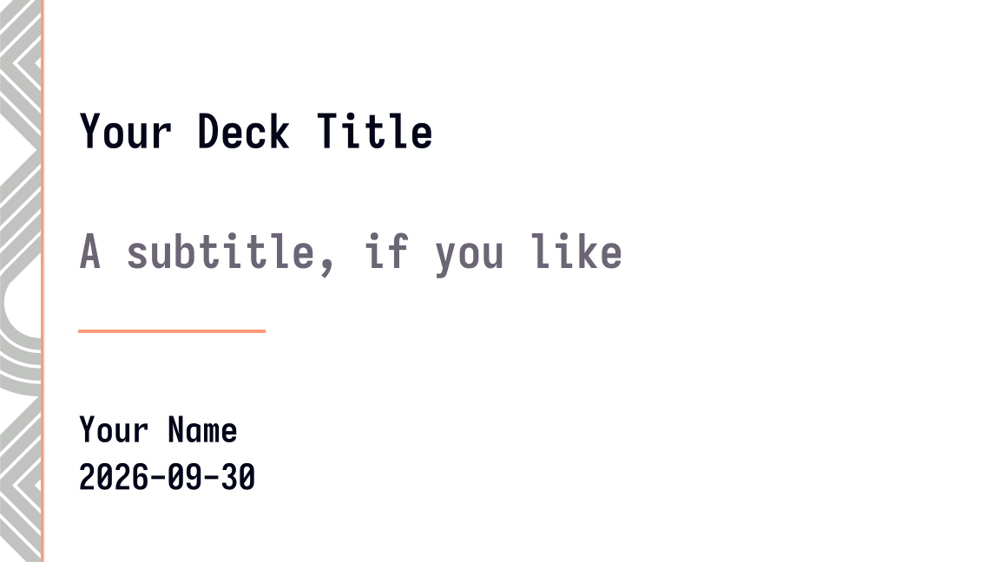
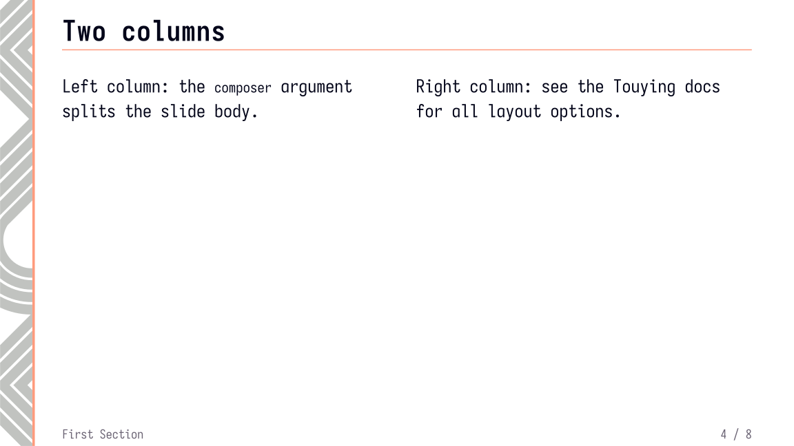

# Slide template (Typst + Touying)

Custom `typst` [Touying](https://typst.app/universe/package/touying/) presentation
theme.

```
main.typ       example deck — edit this
sidebar.typ    the theme (custom Touying theme wrapping the SVG art)
palette.typ    the brand palette (single source of truth for colors)
template.svg   the source art (unchanged)
colorpalette.svg  the original palette reference
fonts/         font fetch script target (Iosevka SS07; gitignored, see fonts/README.md)
```

## Preview

<!-- slides:start -->

| Slides (15)                      |
| -------------------------------- |
|    |
|    |
|    |
|    |
|    |
|    |
|    |
|    |
|    |
|  |
|  |
|  |
|  |
|  |
|  |

<!-- slides:end -->

## Quick start

Requires **typst >= 0.15** and network access once (touying is fetched automatically on
first compile):

```sh
typst compile main.typ          # PDF
typst compile --ppi 150 main.typ "slide-{n}.png"
```

Structure your deck with headings; the sidebar, header, footer and page numbers are
automatic:

```typst
#import "@preview/touying:0.8.0": *
#import "sidebar.typ": *

#show: sidebar-theme.with(
  config-info(
    title: [Your Deck Title],
    author: [Your Name],
    date: datetime.today(),
  ),
)

#title-slide()

= Section

== Slide title

- content ...

#focus-slide[One big idea.]
```

Available slide functions (from `sidebar.typ`): `slide`, `title-slide`, `outline-slide`,
`focus-slide`, plus automatic section dividers for each `= heading`,
`#speaker-note[..]`, `#pause` and friends (Touying built-ins).

## How the geometry works

`template.svg` has a `viewBox` of 4800 x 2700 = a 16:9 slide at 300 units/inch, i.e.
**16in x 9in**. The sidebar art ends at x = 210.585 units = **0.70"** — that is where
the "0.7 inch sidebar" comes from. The theme therefore:

- sets the page to `width: 16in, height: 9in` (overriding Touying's default 10in
  `presentation-16-9`),
- places the SVG as a full-page `background` at 100%, and
- keeps a left margin of 1.25" so content clears the 0.7" sidebar.

If you change the art, adjust `sidebar-width` / the margin accordingly.

### Why inches (and the 1600 x 900 px alternative)

The page is `16in x 9in` because that is what the SVG encodes (4800 x 2700 at 300
units/inch), which makes the sidebar exactly the specified 0.70". Typst's `px` unit is
1/96 inch, so a `1600px x 900px` page would actually be 16.67in x 9.375in — the same
16:9 shape, but every absolute size (including the sidebar, which would become ~0.73")
grows by ~4%. If you prefer designing in px anyway, change
`config-page(width: .., height: ..)` and the margin dictionary in `sidebar.typ` to px
values; everything else is in `em`/`%` and scales automatically.

## Customization

All of these go inside `#show: sidebar-theme.with(...)`:

- `footer:` bottom-left text (default: the current section title)
- `header-right:` top-right content (default: `info.logo`)
- `margin:` page margins dictionary
- `background:` `auto` (the SVG), an image path string, or `none`
- `config-colors(primary: ..)`, `config-info(..)`, and any other Touying `config-*` —
  they merge over the theme defaults

Colors come from `palette.typ`, transcribed from `colorpalette.svg` (typst cannot read
colors out of an SVG at compile time, so the module is the single source of truth —
update the hexes there if the SVG changes). The theme maps them onto Touying's roles:
`primary` = orange `#FF9B7D` (the sidebar bar), `secondary` = the anchor purple
`#71618D`, body text = ink `#030519`, meta text = `#6C6575`. `#alert[..]` uses the
accent color `#B9497B`; plain `*bold*` stays ink-colored (the theme sets
`show-strong-with-alert: false`). Decks can use any color directly:

```typst
#import "palette.typ": palette
#text(fill: palette.teal)[teal text]
```

Fonts: the theme sets *Iosevka SS07* throughout — body text, titles and code
(`sidebar-theme(body-font: .., title-font: .., code-font: ..)` overrides; the code chain
also accepts `Iosevka Term SS07`). Until installed, compiles fall back down the chain
(Libertinus Serif / DejaVu Sans Mono).

The font is not committed (the `.ttc` is ~80 MB): fetch it once per clone with

```sh
sh scripts/fetch-fonts.sh
```

which pulls the pinned `IosevkaSS07.ttc` (v34.9.0, same file Homebrew's
`font-iosevka-ss07` cask installs) plus its OFL license into gitignored `fonts/`. It's a
no-op when the font is already present, and CI runs it automatically before compiling.
Unvendored machines can instead `brew install --cask font-iosevka-ss07`. The fixed fetch
commands and version-pinning notes live in `fonts/README.md`.

## Notes on the SVG

- The SVG exports from Affinity Designer contain pairs of invisible outline paths
  (`fill: rgb(240,212,2); fill-opacity: 0`) — invisible clutter that is safe to delete
  if you want a smaller file.
- The visible design: ~60% opacity gray diagonal slashes + two chevrons, plus the solid
  orange bar at x = 0.65"–0.70".
